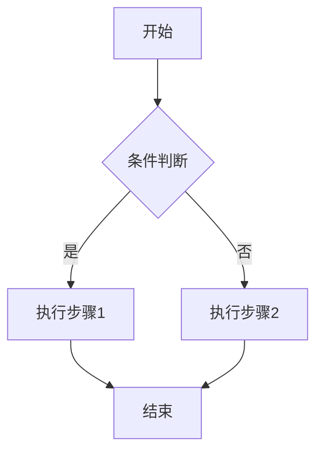
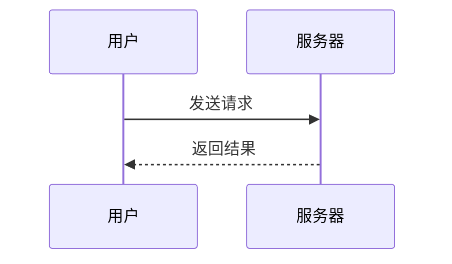
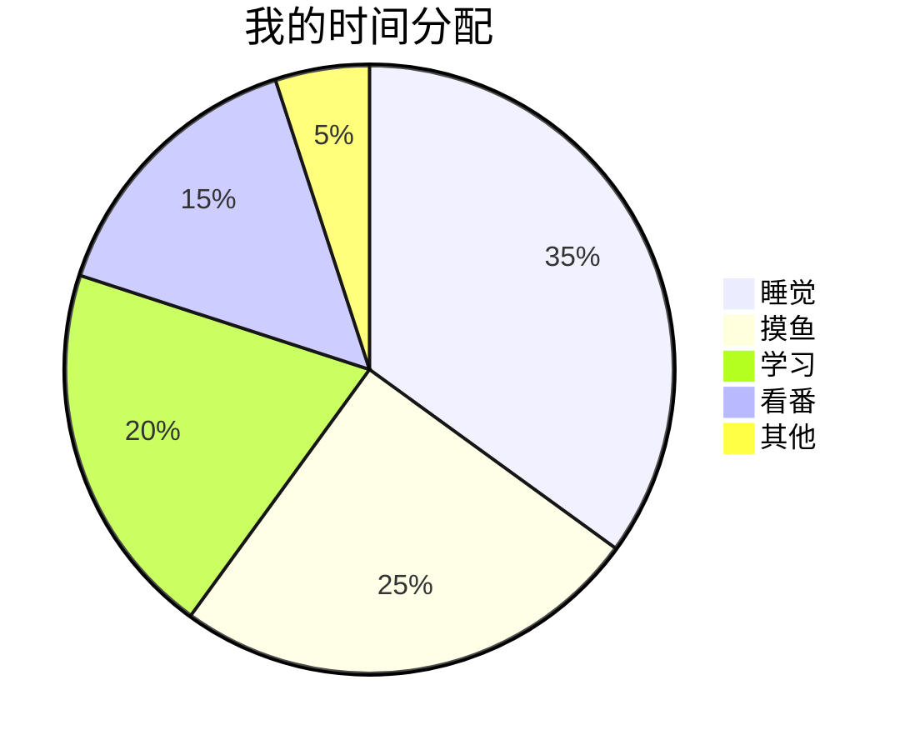

Mermaid 是一个很方便的工具，可以直接用文字来画图表，不需要手动画图～

## 流程图

```mermaid
graph TD
    A[开始] --> B{条件判断}
    B -->|是| C[执行步骤1]
    B -->|否| D[执行步骤2]
    C --> E[结束]
    D --> E
```

## 时序图

```mermaid
sequenceDiagram
    participant 用户
    participant 服务器
    用户->>服务器: 发送请求
    服务器-->>用户: 返回结果
```

## 饼图

```mermaid
pie title 我的时间分配
    "睡觉" : 35
    "摸鱼" : 25
    "学习" : 20
    "看番" : 15
    "其他" : 5
```

Mermaid 支持很多种图表类型，具体可以参考[官方文档](https://mermaid.js.org/)。
